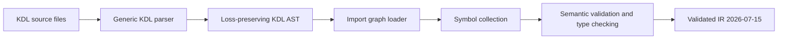

# Compiler pipeline

The generic parser preserves property order and duplicates. Application-level rejection occurs in the semantic phase, allowing diagnostics such as `E_DUPLICATE_PROPERTY` rather than silently applying KDL's rightmost-property behavior.

No network request, browser launch, navigation, session mutation, or external transform call exists in the compiler package. The compiler only reads the entry KDL file and relative imported modules.

## Package boundaries

- `internal/kdl`: lexical and generic tree syntax
- `internal/typesys`: type parser and assignability
- `internal/compiler`: imports, symbols, validation, capability derivation, lowering
- `internal/ir`: JSON-serializable Validated IR
- `internal/diagnostic`: stable diagnostics and rendering
- `cmd/scrape-kdl`: CLI
